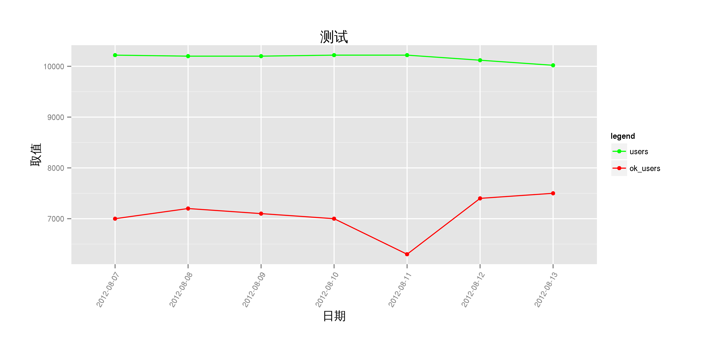
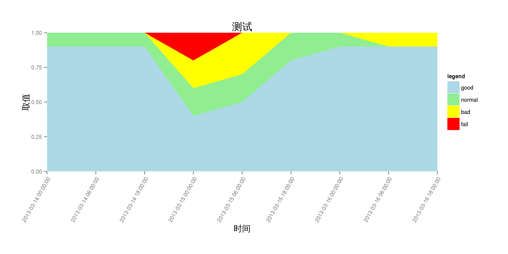
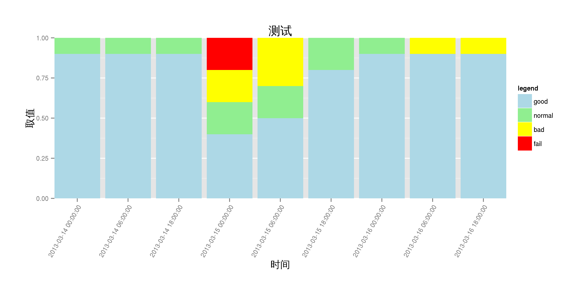
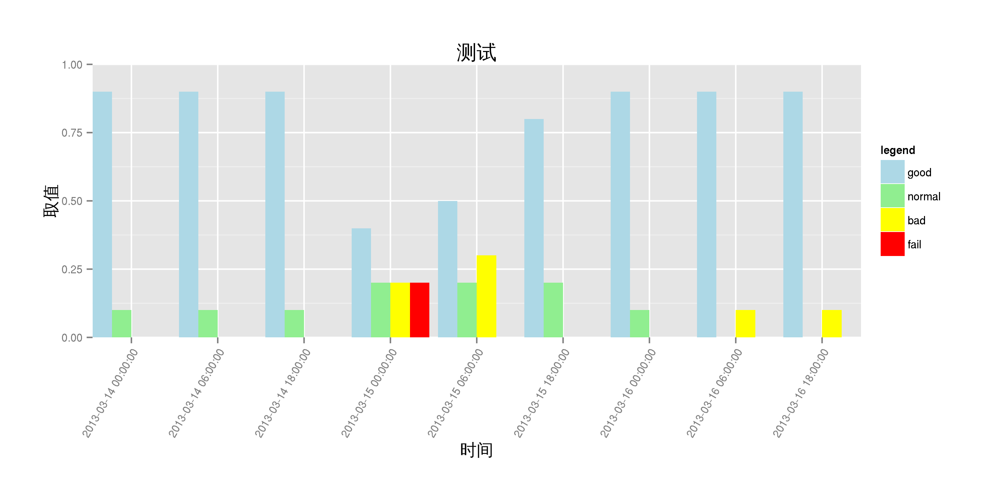
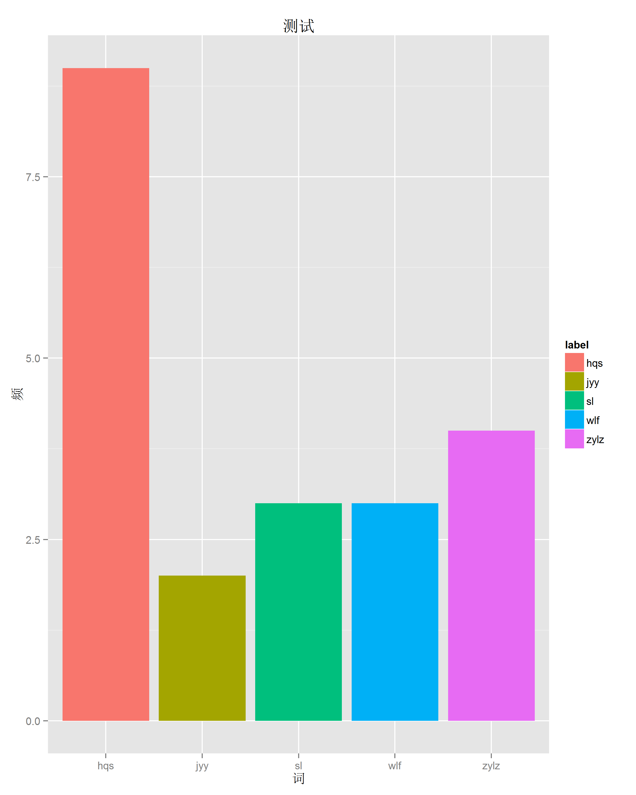
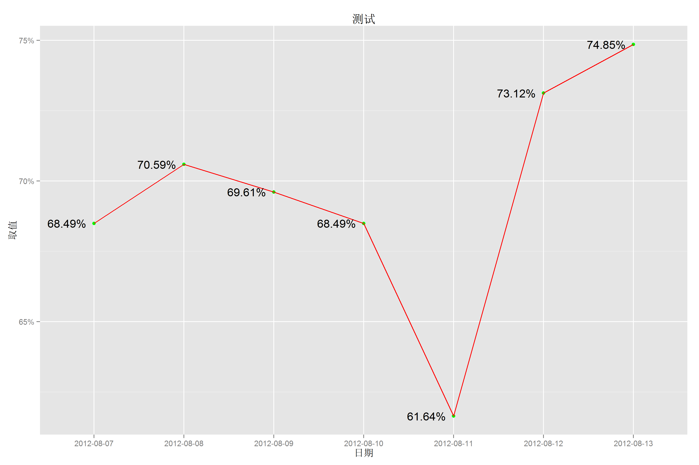
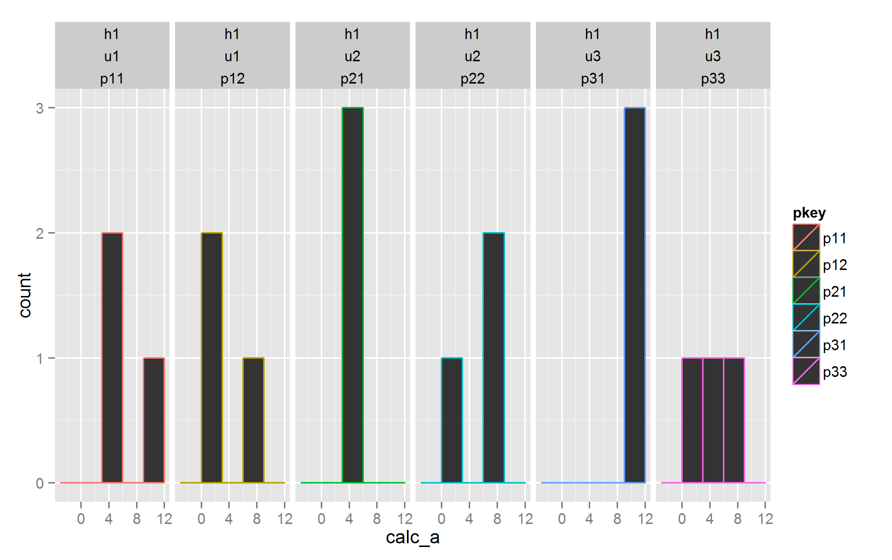
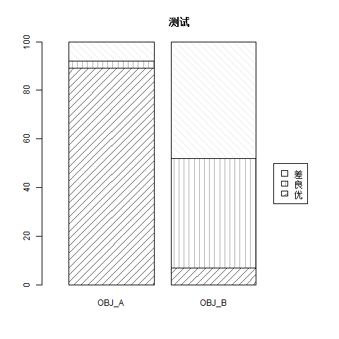

example
=============

chart example,  with  r , ggplot2,  etc

## ggplot2

参考：[ggplot2 doc](http://docs.ggplot2.org/current/)

源码： [chart_ggplot2.r](chart_ggplot2.r)

### line 折线图

[01.line.r](01.line.r)

### stacked_area 面积图

[02.stacked_area.r](02.stacked_area.r)

### stacked_bar 累积柱状图 

[03.stacked_bar.r](03.stacked_bar.r)

### multi_bar 多柱图 

[04.multi_bar.r](04.multi_bar.r)

### bar 柱状图 

[05.bar.r](05.bar.r)

### line_rate 折线比例图

[06.line_rate.r](06.line_rate.r)

### hist_bar_facets 直方图，群组

[07.hist_bar_facets.r](07.hist_bar_facets.r)

## barplot

### stacked_bar 累积柱状图，黑白、斜线填充

[08.barplot_stackedbar.r](08.barplot_stackedbar.r)

