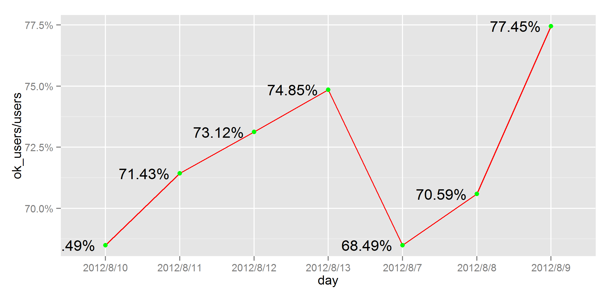
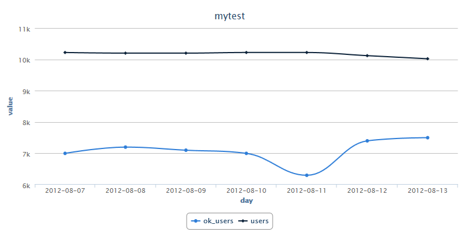
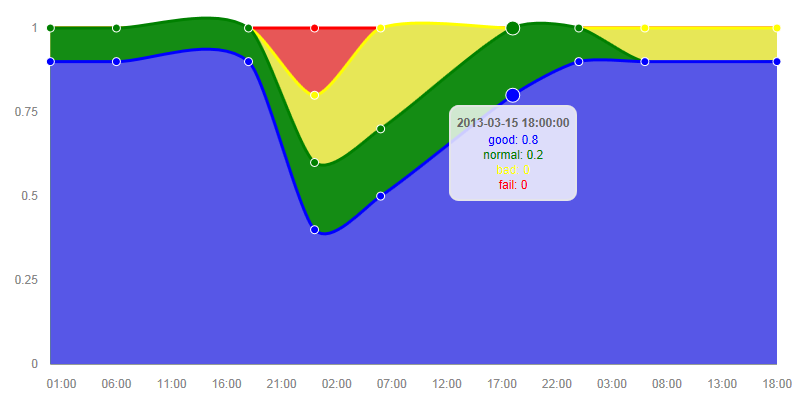
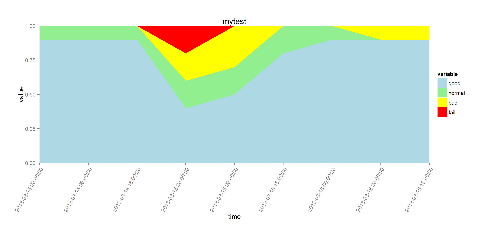
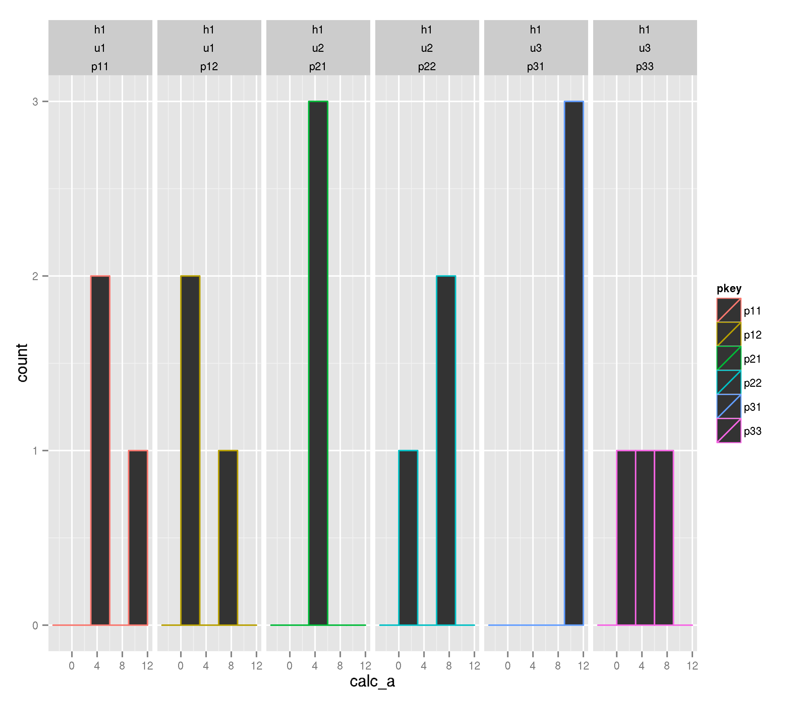
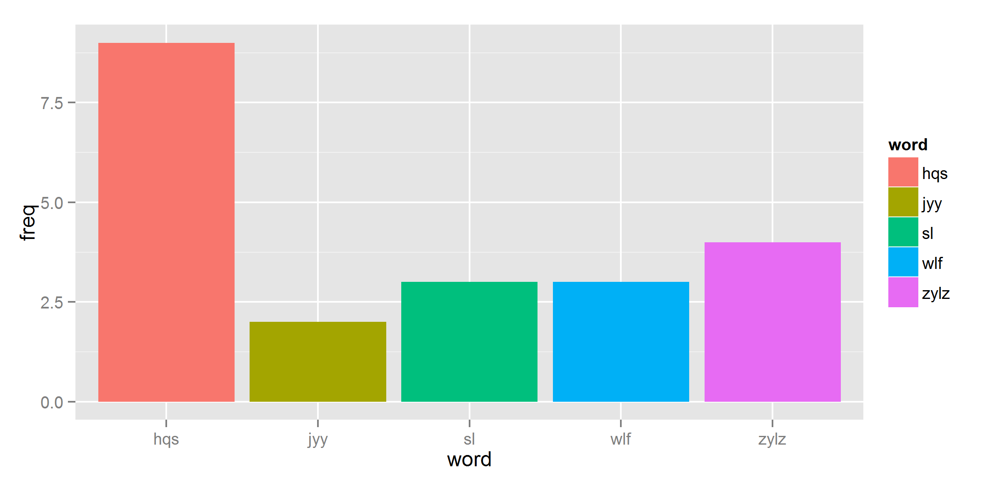
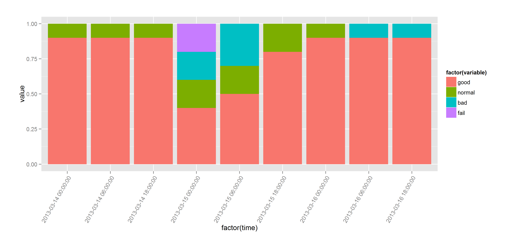

chart_example
=============

chart example,  with  ggplot2, rcharts etc

参考：[ggplot2 doc](http://docs.ggplot2.org/current/)

## symbol_line 折线图

### [symbol_line-rcharts.r](symbol_line-rcharts.r)

### [symbol_line-ggplot2.r](symbol_line-ggplot2.r)

### [symbol_line-rate-ggplot2.r](symbol_line-rate-ggplot2.r)

## spline_line 平滑曲线图

### [spline_line-rcharts.r](spline_line-rcharts.r)

## stacked_area 面积图

### [stacked_area-rcharts.r](stacked_area-rcharts.r)

### [stacked_area-ggplot2.r](stacked_area-ggplot2.r)

## bar 柱状图

### 直方图 [hist_bar-facets-ggplot2.r](hist_bar-facets-ggplot2.r)

### 多个颜色柱状图 [multi_color_bar-ggplot2.r](multi_color_bar-ggplot2.r)

### 累积柱状图 [stacked_bar-ggplot2.r](stacked_bar-ggplot2.r)

### 多柱图 [multi_bar-ggplot2.r](multi_bar-ggplot2.r)

