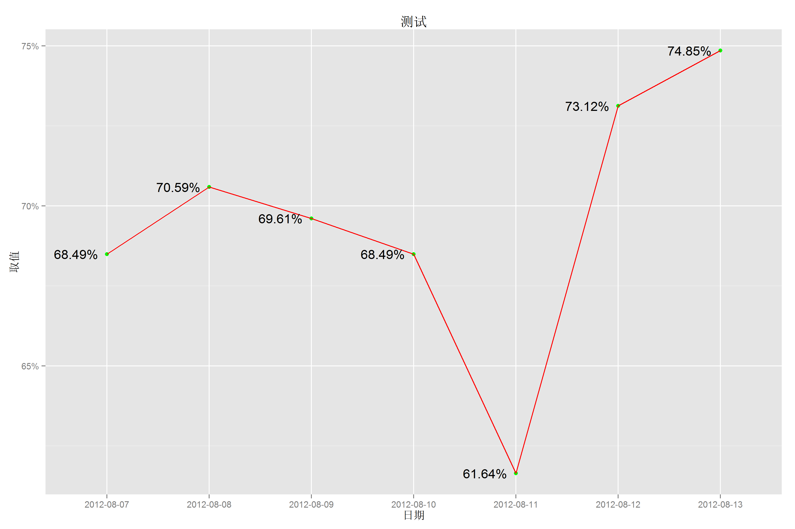
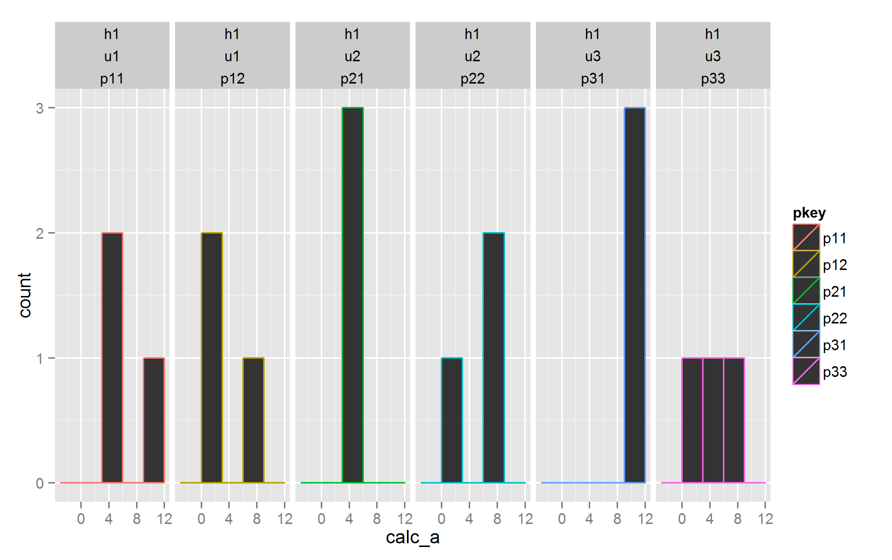

chart_example
=============

chart example,  with  ggplot2,  etc

## ggplot2

参考：[ggplot2 doc](http://docs.ggplot2.org/current/)

源码： [chart_ggplot2.r](chart_ggplot2.r)

### chart_line 折线图

[01.chart_line.r](01.chart_line.r)

### chart_stacked_area 面积图

[02.chart_stacked_area.r](02.chart_stacked_area.r)

### chart_stacked_bar 累积柱状图 

[03.chart_stacked_bar.r](03.chart_stacked_bar.r)

### chart_multi_bar 多柱图 

[04.chart_multi_bar.r](04.chart_multi_bar.r)

### chart_bar 柱状图 

[05.chart_bar.r](05.chart_bar.r)

### chart_line_rate 折线比例图

[06.chart_line_rate.r](06.chart_line_rate.r)

### chart_hist_bar_facets 直方图，群组

[07.chart_hist_bar_facets.r](07.chart_hist_bar_facets.r)

