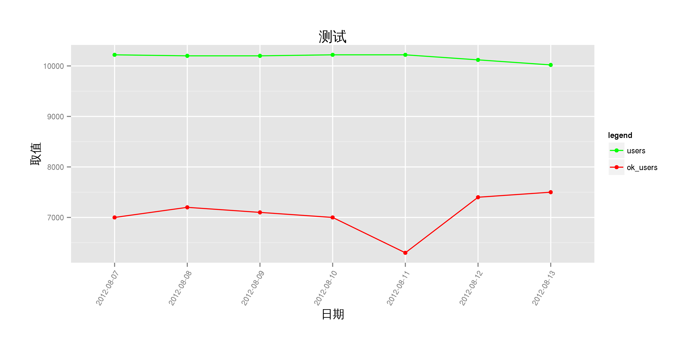
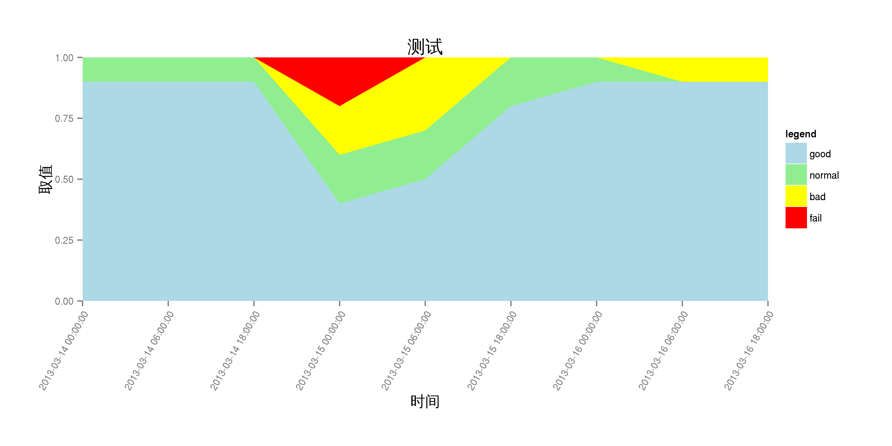
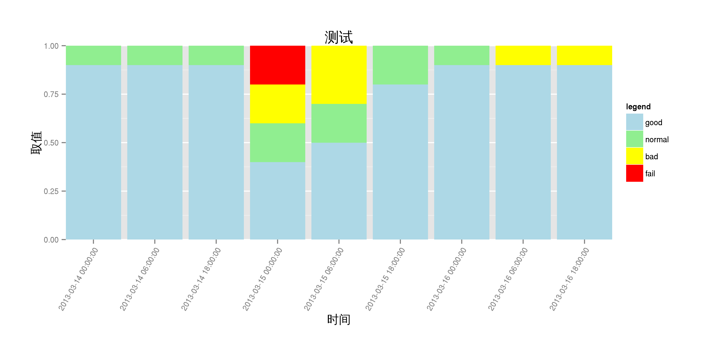
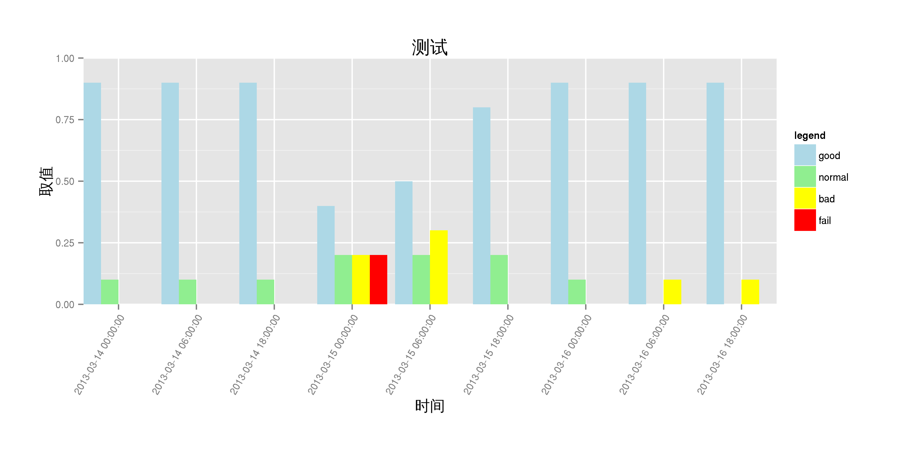
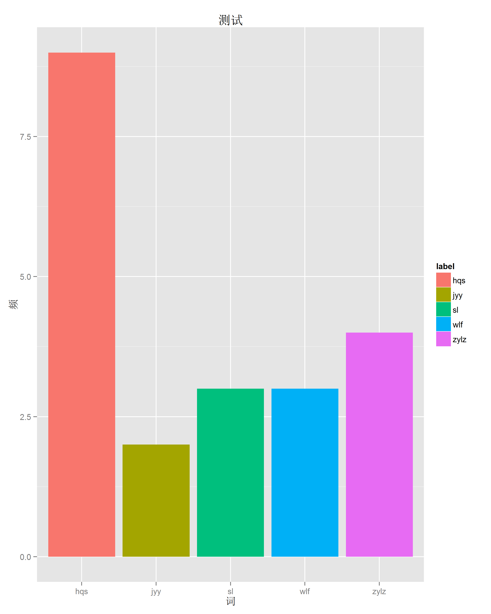

chart_example
=============

chart example,  with  ggplot2, rcharts etc

## ggplot2

参考：[ggplot2 doc](http://docs.ggplot2.org/current/)

源码： [chart_ggplot2.r](chart_ggplot2.r)

### chart_line 折线图

[01.chart_line.r](01.chart_line.r)

### chart_stacked_area 面积图

[02.chart_stacked_area.r](02.chart_stacked_area.r)

### chart_stacked_bar 累积柱状图 

[03.chart_stacked_bar.r](03.chart_stacked_bar.r)

### chart_multi_bar 多柱图 

[04.chart_multi_bar.r](04.chart_multi_bar.r)

### chart_bar 柱状图 

[05.chart_bar.r](05.chart_bar.r)

## symbol_line 折线图

### [symbol_line-rcharts.r](symbol_line-rcharts.r)

### [symbol_line-rate-ggplot2.r](symbol_line-rate-ggplot2.r)

## spline_line 平滑曲线图

### [spline_line-rcharts.r](spline_line-rcharts.r)

## stacked_area 面积图

### [stacked_area-rcharts.r](stacked_area-rcharts.r)

## bar 柱状图

### 直方图 [hist_bar-facets-ggplot2.r](hist_bar-facets-ggplot2.r)

